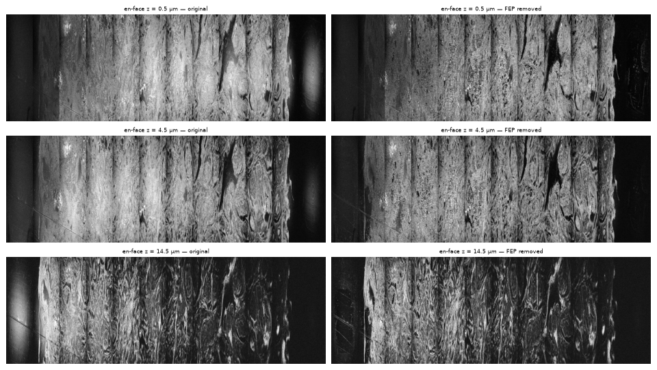
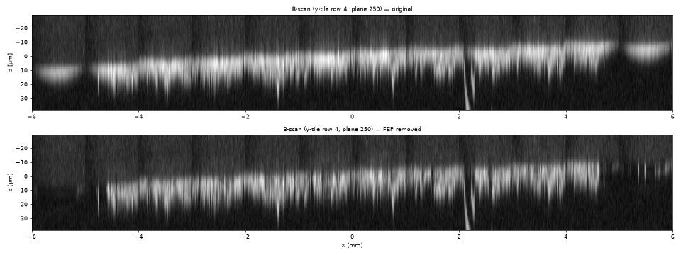

# 07 — Removing the FEP-film reflections (new in v2)

The tissue is imaged sandwiched in FEP film. The film surfaces are smooth, flat dielectric
interfaces, so they give **specular reflections** that are 10–30 dB brighter than tissue: a
bright sheet at the tissue surface (z ≈ 0) and, when it is inside the reconstructed depth
range, at the bottom surface too. In the stitched volume they show up as a bright band in every
B-scan and as round, tile-periodic blobs in en-face planes (the specular return depends on the
scan angle, so it is bright in the tile centre and fades towards the edges).

v2 removes these reflections **before** the magnitude is taken (in the complex depth profile of
every A-line), so that the reconstructed volume only contains tissue signal. It is on by default
(`fep_removal=True`); `fep_removal=False` (`--no-fep`, or untick the box in the web app) gives
the v1 / legacy-identical output.

*Data set `10um_FOV_1`, y-tile row 4 (500 output planes), left: original, right/bottom: FEP
removed (final method). Display range is the same for both.*

## Why it is possible

A specular reflector at depth `m` produces exactly the system point-spread function (PSF) in the
complex A-scan: `a(z) = A·e^{iφ}·psf(z − m)`. The PSF is fixed by the spectral window and the
residual dispersion; it is only 2–3 pixels wide. Tissue is a volume scatterer: its complex A-scan
is speckle, which has energy in all directions of the local (2R+1)-sample space. So the
reflection lives in a tiny subspace (the PSF at sub-pixel shifts: rank ≈ 3 out of 17 dimensions),
and tissue only has ≈ 3/17 of its energy there.

Things that do **not** work well on this data (measured, see the investigation notes in the PR):

* averaging / subtracting a lateral (x or y) mean A-line — the film amplitude jitters by ±20 %
  from A-line to A-line, the B-scan-to-B-scan phase is random, so lateral methods saturate at
  10–17 dB of suppression;
* low-rank (SVD) background removal in a B-scan window — tissue is locally low-rank, too;
* zeroing / notching the band — destroys the tissue at the surface.

## Algorithm (`octrecon/core/fep.py`)

Per tile and batch of B-scans (complex scans, before the magnitude):

1. **Detect surfaces.** Curvature-flatten |scan| with the optical-path (field-curvature) shift,
   average laterally (central 70 % of x) and find sharp peaks ≥ `fep_detect_min_db` (6 dB) above
   the 51-row median baseline. Only the depth band that reaches the output is analysed.
   Up to `fep_max_surfaces` (4) are handled — top / bottom film surfaces, film back sides.
2. **Locate the surface in every A-line.** Expected native row = surface row + curvature shift;
   refined by an arg-max within ±`fep_search` (4) px and a lateral median over
   `fep_lateral_median` (15) A-lines, so a bright tissue speckle cannot hijack it.
3. **Project onto the PSF basis.** The complex segment of ±`fep_half_window` (R = 8) samples
   around the peak is projected onto a rank-`fep_rank` (3) basis. The basis is learnt from the scan
   itself at start-up (≈ 6 000 strong, PSF-like surface segments from 12 tiles spread over the
   grid; bootstrapped from the theoretical PSF of the window). On this data it captures 96.8 % of
   the film-reflection energy (theoretical PSF: 85.5 %), because it also absorbs the residual
   dispersion.
4. **Decide where a film is present.** The fraction of segment energy captured by the basis
   ("specular-likeness", lateral median) gives a soft weight: 0 below `fep_frac_lo` (0.35),
   1 above `fep_frac_hi` (0.6). Tissue without a film reflection is left untouched.
5. **Subtract down to the background level, not to zero.** The background / tissue speckle also
   has energy along the basis (≈ `rank` × local background power, measured on ±10 rows outside
   the window). Removing the whole projection leaves a dark trench (≈ −6 dB) where the film was.
   The coefficient is therefore shrunk to the local background energy:
   `c ← c · sqrt(keep · rank · P_bg / |c|²)` (`fep_keep_level` = keep = 0.7). With `keep = 0` the
   whole projection is removed.
6. **Never remove more than the film can account for (coherence cap, protects the tissue).**
   A single A-line cannot tell a film reflection from a bright, PSF-shaped tissue speckle at the
   surface — steps 3–5 alone removed 6–11 dB of the tissue signal at the surface (also at the
   tile corners where the film is weak). The film, however, is one continuous mirror: its complex
   signal stays phase-consistent from A-line to A-line, while tissue speckle decorrelates beyond
   the speckle size. The film energy is therefore estimated from the lateral coherence,
   `q(x) = <s(x), s(x+L)>` (both segments on the rows of A-line x, lag L = `fep_coh_lag` = 4
   A-lines = 8 µm), averaged over W = `fep_coh_window` = 31 A-lines and corrected for the
   incoherent bias: `E_f = sqrt(max(|mean q|² − mean|q|²/W, 0))`. The subtraction is capped:
   `g ← g · min(1, (1 + margin) · sqrt(E_f / |c|²))`, margin = `fep_coh_margin` = 1.0 (the film's ±20 % amplitude jitter and the
   decorrelation of the lag product by field curvature). Pure film: E_f ≈ |c|², removed as before. Tissue: E_f ≈ 0,
   left in place. Mixed: only the film's share is removed.

Everything outside the ±R window (+ search range) is bit-identical to the input; inside it only
the `rank` PSF components are changed. Heavy work runs on the selected device (CuPy / PyTorch);
only small (B, nX) arrays go to the host.

## Results

All numbers are for the final method (coherence cap on, defaults above); "uncapped" is the same
method without step 6 (the first v2 version).

**Synthetic ground truth** (`tests/test_fep.py`; reflection = exact PSF with sub-pixel tilt, laterally
coherent phase, ±20 % amplitude jitter, on speckle tissue):

| case | before | after |
|---|---|---|
| reflection +10/+20/+30 dB on tissue | residual error ≥ amp − 12 dB rel. tissue | < −6 dB rel. tissue |
| reflection on empty background | — | within ±3 dB of the background (no trench) |
| tissue without reflection | — | change < −20 dB rel. tissue |
| bright incoherent (speckle-like) peaks | — | left in place (change < −10 dB) |

**Tissue preservation — ground truth from real data.** Real tissue from just below the removal
window (no film signal) placed under a real film reflection from a tile without tissue, at the film
strength of the data (0 dB) and 10 dB weaker / stronger. Error of the output vs the true tissue in
the 9 rows under the film peak (dB rel. tissue; lower is better) and correlation of the magnitudes:

| film | no removal | uncapped | final |
|---|---|---|---|
| none (tissue only) | 0 / 1.00 | −6.1 dB / 0.84 | **−15.1 dB / 0.98** |
| −10 dB (weak, like tile corners) | −5.4 dB / 0.90 | −4.0 dB / 0.74 | **−7.7 dB / 0.91** |
| 0 dB (as in the data) | +4.6 dB / 0.55 | −2.0 dB / 0.57 | **−2.8 dB / 0.70** |
| +10 dB | +14.6 dB / 0.32 | +3.8 dB / 0.27 | +3.9 dB / 0.28 |

**Real data, y-tile row 4** (stitched output). Film where it is the only signal (tiles without
tissue), peak above the background: 14.3 / 16.7 dB → **1.9 / 2.0 dB** (uncapped: 1.9 / 2.0 dB).
Change of the tissue signal at the surface (z = −1.5 µm) relative to v1: tile corners (weak film)
−7.7 dB uncapped → **−1.9 dB**; tile centres (strong film glow) −11.3 dB → **−5.0 dB**.
En-face statistics (dB, v1 → final):

| output depth | median | 99th percentile |
|---|---|---|
| z = −5.5 µm (film above tissue) | −10.7 → −12.8 | 7.9 → 5.7 |
| z = 0.5 µm (tissue surface) | −5.1 → −8.6 | 10.2 → 7.8 |
| z = 4.5 µm | −5.1 → −7.9 | 10.7 → 8.4 |
| z = 8.5 µm | −7.4 → −10.3 | 9.5 → 7.5 |
| z = 14.5 µm | −14.7 → −15.6 | 6.0 → 5.0 |
| z = 30.5 µm (deep tissue) | −18.2 → −18.2 | −9.4 → −9.5 |

**Cost, full volume** (4500 × 35 × 6000, RTX 3080 Ti Laptop, raw data on a USB SSD, 2026-10-08):
reconstruction 1177 s with FEP removal off vs 1262 s on (+7.3 %); the run is limited by reading the
raw data (I/O wait 350 s → 165 s), so most of the extra GPU work fills time spent waiting for the
disk. Plus ≈ 12 s at start-up (incl. learning the basis) and ≈ 2.2 min for the v2 outputs (tissue
mask + projections, removed-signal volume).

## Limitations

* Tissue that is itself specular *and laterally coherent* at the film interface (a flat, smooth
  tissue boundary pressed against the film, which reflects because of the refractive-index step) is
  indistinguishable from the film and is attenuated with it; part of the remaining reduction at the
  tile centres is of this kind.
* Inside the film window, the reconstructed tissue keeps its intensity level, but the
  `rank` PSF components are partly replaced by the background-level remainder of the film
  coefficient: the fine axial speckle pattern within ±1–2 px of the surface is not original.
* For very strong film (+10 dB above the data), the part of the reflection outside the rank-3
  subspace (its wings) remains a few dB above the tissue.
* Tile seams / tile-periodic illumination (vignetting) are a different effect and are not
  addressed by this step.

## Parameters

| ReconConfig field | default | meaning |
|---|---|---|
| `fep_removal` | `True` | enable the step |
| `fep_keep_level` | 0.7 | background energy kept along the basis (0 = remove all) |
| `fep_coherence_limit` | `True` | cap the removal at the laterally coherent film energy (step 6; protects tissue) |
| `fep_coh_lag`, `fep_coh_window`, `fep_coh_margin` | 4, 31, 1.0 | lag (A-lines), averaging window (A-lines), allowed excess |
| `fep_bg_mode` | `both` | background power for step 5: `both` sides, brighter side (`max`), or `inside` the window |
| `fep_rank` | 3 | PSF basis size |
| `fep_half_window` | 8 | R, samples on each side of the surface |
| `fep_search` | 4 | ± samples searched for the per-A-line peak |
| `fep_lateral_median` | 15 | A-lines for the position / decision median |
| `fep_frac_lo`, `fep_frac_hi` | 0.35, 0.60 | specular-likeness ramp |
| `fep_detect_min_db` | 6 | surface detection threshold |
| `fep_max_surfaces` | 4 | surfaces per B-scan batch |
| `fep_shrink` | `True` | background-level shrinkage (False = subtract the full projection) |
| `fep_learn_basis` | `True` | learn the basis from the scan (False = theoretical PSF) |
| `fep_basis_file` | `None` | `.npy` (2R+1, rank) complex basis; overrides learning |
| `fep_save_removed` | `True` | also save the removed signal: volume `<name>_fep_removed.tiff`, its xy projection and `<name>_fep_overview.png` (see doc 08) |

The run summary (`<output_name>_run_summary.json`) records the learnt basis (captured energy,
number of segments) and the removal statistics under `fep_removal`.
